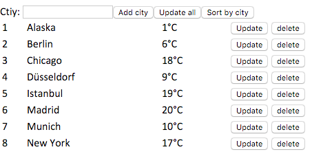

# Elm OpenWeatherMap example application

This simple elm application demonstrate how to use the [OpenWeatherMap API]("http://www.openweathermap.org/api").

## Requirements

* Elm version 0.17.x (see http://elm-lang.org/install)

## Installation

1. Get an API key from the [OpenWeatherMap website](http://www.openweathermap.org/appid#get)
2. Add your API key to config.elm
3. Run `elm reactor` from the project directory
4. Open `localhost:8000` from your browser and click on `Main.elm`

If you get errors remove the `elm-stuff` directory.

## Run tests

1. `cd test`
2. `elm-make Update.elm --output test.js`
3. `node test.js`
